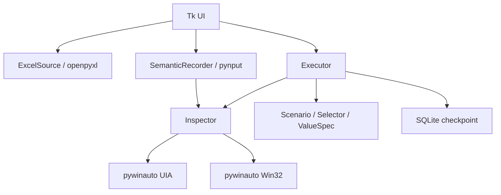
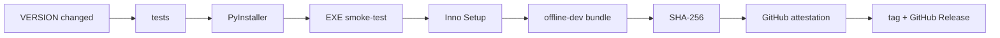

# Win Automator

[](https://github.com/f2re/win-automator/actions/workflows/windows-build.yml)
[](https://github.com/f2re/win-automator/releases/latest)
[](https://github.com/f2re/win-automator/releases)


**Win Automator** — обучаемый автоматизатор ввода данных из Excel в формы Windows-приложений. Оператор один раз показывает, как заполнить запись; программа связывает действия с колонками Excel и смысловыми UI Automation / Win32-элементами, после чего воспроизводит сценарий для остальных строк.

> Для обычного оператора Python и установка библиотек не нужны. Берите готовый `Setup.exe` или portable ZIP из [последнего релиза](https://github.com/f2re/win-automator/releases/latest).

## Скачать и запустить

| Вариант | Для кого | Что делать |
|---|---|---|
| `WinAutomator-<version>-Setup-win-x64.exe` | обычный пользователь | скачать → запустить установщик → открыть Win Automator |
| `WinAutomator-<version>-win-x64.zip` | portable / без установки | распаковать → запустить `WinAutomator.exe` |
| `WinAutomator-<version>-offline-dev.zip` | закрытая сеть / разработчик | распаковать → `bootstrap.ps1 -Offline` |
| `SHA256SUMS.txt` | проверка целостности | сверить SHA-256 скачанных файлов |

Установщик ставится в профиль пользователя и не требует прав администратора. Минимальная целевая ОС — **Windows 7 SP1 x64**; основной тестовый путь — Windows 10 x64.

## Как это работает

```mermaid
flowchart LR
    X["Excel .xlsx"] --> D["Данные"]
    D --> T["Обучение на одной строке"]
    T --> R["Semantic Recorder"]
    R --> I["UIA / Win32 Inspector"]
    I --> S["Versioned Scenario JSON"]
    S --> E["Редактор и повторный захват"]
    E --> V["Проверка на следующей строке"]
    V --> B["Пакетное выполнение"]
    B --> C["Checkpoint SQLite"]
    C -. resume .-> B
```



Win Automator старается запоминать не координаты экрана, а признаки элемента: `AutomationId`, `ControlId`, тип контрола, имя, класс, родителя и окно. Это делает сценарий устойчивее к перемещению окна и небольшим изменениям интерфейса.

## Быстрый рабочий сценарий

1. Откройте вкладку **Данные** и выберите `.xlsx`.
2. Выберите лист и проверьте строки в предпросмотре.
3. На вкладке **Сценарий** нажмите **Обучить на первой записи**.
4. В целевой программе вручную заполните одну запись.
5. `F8` — пауза/продолжение записи, `F9` — закончить обучение.
6. Проверьте сформированные шаги; при необходимости исправьте поле или выполните **Указать заново**.
7. Выполните тест на следующей строке.
8. Запустите пакетную обработку. При ошибке используется checkpoint, поэтому задание можно продолжить с проблемной строки.

## Возможности 0.2

- чтение `.xlsx` без установленного Microsoft Excel;
- запись глобальных действий мыши и клавиатуры;
- UI Automation + Win32 fingerprint вместо жесткой привязки к координатам;
- `SET_VALUE`, `SELECT`, `CLICK`, `DOUBLE_CLICK`, `KEY`, `CLOSE_WINDOW`, `START_APP`;
- автоматическое сопоставление введенного значения с колонкой Excel;
- визуальный редактор шагов и повторный захват контрола;
- проверка сценария перед массовым запуском;
- пакетная обработка с паузой, остановкой, retry и checkpoint в SQLite;
- автономный Windows x64 executable;
- установщик без прав администратора;
- portable ZIP;
- air-gapped developer bundle с Python 3.8.10 и wheels;
- CI, SemVer, автоматические GitHub Releases, SHA-256 и build provenance attestations.

## Пример

Готовый учебный комплект находится в [`examples/employee-entry`](examples/employee-entry):

```text
examples/employee-entry/
├── README.md
├── sample-data.xlsx
└── scenario.json
```

Он рассчитан на тестовую WinForms-форму:

```powershell
powershell -ExecutionPolicy Bypass -File .\scripts\TargetForm.ps1
```

После запуска формы откройте `sample-data.xlsx`, обучите сценарий на первой строке и проверьте выполнение на следующих.

Подробнее: [docs/EXAMPLES.md](docs/EXAMPLES.md).

## Формат сценария

```json
{
  "version": 1,
  "name": "Ввод сотрудников",
  "steps": [
    {
      "action": "set_value",
      "target": {
        "backend": "uia",
        "window_title": "Карточка сотрудника — тест Win Automator",
        "automation_id": "txtFullName",
        "control_type": "Edit",
        "name": "ФИО"
      },
      "value": {
        "source": "excel",
        "column": "ФИО",
        "literal": ""
      },
      "timeout": 10.0
    }
  ]
}
```

Формат versioned: изменения, которые нарушают обратную совместимость сценариев, должны сопровождаться миграцией и изменением версии схемы.

## Архитектура



Подробное описание компонентов, selector scoring и границ MVP: [docs/ARCHITECTURE.md](docs/ARCHITECTURE.md).

## Разработка

Windows PowerShell:

```powershell
powershell -NoProfile -ExecutionPolicy Bypass -File .\bootstrap.ps1
```

Скрипт использует приватный Python 3.8.10 в `.runtime`, создает `.venv`, устанавливает зафиксированные зависимости, выполняет self-test и запускает приложение. Системный `PATH` не меняется.

Сборка:

```powershell
powershell -NoProfile -ExecutionPolicy Bypass -File .\build.ps1
```

Если установлен Inno Setup 6, дополнительно будет создан `Setup.exe`. В CI установщик обязателен.

## Релизы и версионирование

`VERSION` — единственный источник версии. Проект следует **Semantic Versioning**:

- `PATCH` — исправление без изменения публичного поведения;
- `MINOR` — совместимое расширение функций;
- `MAJOR` — несовместимое изменение сценариев, данных или пользовательского контракта.

Новая версия задается командой:

```powershell
.\scripts\set-version.ps1 0.2.1
```

После commit + push изменения `VERSION` в `main` workflow **Release** автоматически:



Повторная публикация уже существующей версии запрещена: нужно повысить `VERSION`. Полный процесс: [docs/RELEASES.md](docs/RELEASES.md).

## Проверка скачанного релиза

```powershell
Get-FileHash .\WinAutomator-0.2.0-Setup-win-x64.exe -Algorithm SHA256
Get-Content .\SHA256SUMS.txt
```

Для публичных release assets workflow также создает GitHub artifact attestation, позволяющую проверить происхождение сборки.

## Документация

- [Установка и offline-развертывание](docs/INSTALL.md)
- [Примеры](docs/EXAMPLES.md)
- [Архитектура](docs/ARCHITECTURE.md)
- [Версионирование и релизы](docs/RELEASES.md)
- [История изменений](CHANGELOG.md)
- [Участие в разработке](CONTRIBUTING.md)
- [Политика безопасности](SECURITY.md)

## Ограничения

- Во время автоматического ввода не следует параллельно работать мышью/клавиатурой в другом приложении.
- Custom-drawn controls могут быть невидимы для UIA/Win32. OCR/image matching пока не входят в базовый движок.
- Recorder ориентирован на стандартные Edit/Button/ComboBox и близкие элементы. Составные контролы могут потребовать ручной коррекции.
- Python 3.8 завершил upstream-поддержку; он используется как совместимый build/runtime путь для Windows 7. Конечный оператор получает автономный пакет.
- Release EXE/installer пока не подписан коммерческим Authenticode-сертификатом; Windows SmartScreen может показывать предупреждение. Целостность подтверждается SHA-256 и GitHub build provenance.

## Статус

Проект находится на стадии рабочего прототипа. Основной следующий этап — испытания Recorder/Inspector/Executor на реальных целевых Windows-приложениях и добавление fallback-механизмов только там, где UIA/Win32 объективно недостаточно.
