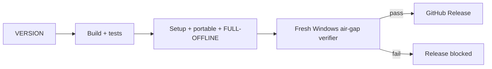
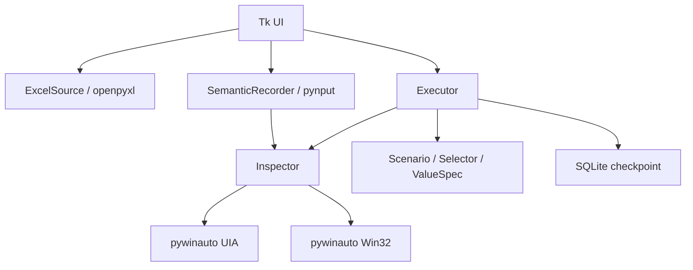

# Win Automator

[](https://github.com/f2re/win-automator/actions/workflows/windows-build.yml)
[](https://github.com/f2re/win-automator/releases/latest)
[](https://github.com/f2re/win-automator/releases)


**Win Automator** — обучаемый автоматизатор ввода данных из Excel в формы Windows-приложений. Оператор один раз показывает, как заполнить запись; программа связывает действия с колонками Excel и устойчивыми UI Automation / Win32-признаками элементов, после чего воспроизводит сценарий для остальных строк.

> **Компьютер без Интернета:** скачайте `WinAutomator-<version>-FULL-OFFLINE-win-x64.zip`. Это готовый операторский пакет: внутри уже есть Setup, portable runtime, локальная проверка SHA-256 и packaged smoke-test. Python, pip и догрузка зависимостей на целевой машине не нужны.

## Скачать

| Файл release | Назначение | Запуск |
|---|---|---|
| `WinAutomator-<version>-FULL-OFFLINE-win-x64.zip` | **изолированная Windows без Интернета** | распаковать → `INSTALL.cmd` |
| `WinAutomator-<version>-Setup-win-x64.exe` | обычная установка | запустить Setup |
| `WinAutomator-<version>-win-x64.zip` | portable | распаковать весь каталог → `WinAutomator.exe` |
| `WinAutomator-<version>-offline-dev.zip` | разработка/диагностика в закрытой сети | `bootstrap.ps1 -Offline` |
| `AIRGAP-VERIFICATION.json` | доказательство offline-теста release | машинно-читаемый отчёт |
| `SHA256SUMS.txt` | контроль целостности | сверить SHA-256 |

### FULL-OFFLINE: что внутри

```text
WinAutomator-<version>-FULL-OFFLINE\
├── INSTALL.cmd
├── RUN-PORTABLE.cmd
├── VERIFY-OFFLINE.ps1
├── OFFLINE-MANIFEST.json
├── README-OFFLINE.txt
├── setup\
│   └── WinAutomator-<version>-Setup-win-x64.exe
└── portable\
    └── WinAutomator\
        ├── WinAutomator.exe
        └── ... встроенный Python runtime, DLL, Tcl/Tk и библиотеки
```

Перед установкой `INSTALL.cmd` проверяет SHA-256 каждого файла и запускает smoke-test уже упакованного приложения. Никаких `pip install`, PyPI, `winget`, Chocolatey или скачивания Python на целевой машине нет.

Подробнее: [docs/INSTALL.md](docs/INSTALL.md).

## Air-gap гарантия release

Release публикуется по цепочке:



Проверяется **точный FULL-OFFLINE ZIP**, который затем публикуется. На чистом Windows runner:

- installer и application EXE получают Windows Firewall outbound `BLOCK`;
- `HTTP_PROXY`, `HTTPS_PROXY`, `ALL_PROXY` направляются на недоступный локальный endpoint;
- системный Python и сторонние инструменты исключаются из `PATH`;
- проверяется внутренний SHA-256 manifest;
- выполняются portable smoke, GUI smoke и обычный запуск;
- выполняются silent install, installed smoke, GUI smoke и обычный запуск;
- выполняется uninstall.

Только после успеха создаётся `AIRGAP-VERIFICATION.json` и разрешается job публикации release.

## Как работает автоматизация

```mermaid
flowchart LR
    X["Excel .xlsx"] --> D["Данные"]
    D --> T["Обучение на одной строке"]
    T --> R["Semantic Recorder"]
    R --> I["UIA / Win32 Inspector"]
    I --> S["Versioned Scenario JSON"]
    S --> E["Редактор / повторный захват"]
    E --> V["Проверка на следующей строке"]
    V --> B["Пакетное выполнение"]
    B --> C["Checkpoint SQLite"]
    C -. resume .-> B
```



Win Automator старается запоминать не координаты экрана, а признаки элемента: `AutomationId`, `ControlId`, тип контрола, имя, класс, родителя и окно. Это делает сценарий устойчивее к перемещению окна и небольшим изменениям интерфейса.

## Рабочий сценарий

1. Откройте вкладку **Данные** и выберите `.xlsx`.
2. Выберите лист и проверьте строки в предпросмотре.
3. На вкладке **Сценарий** нажмите **Обучить на первой записи**.
4. В целевой программе вручную заполните одну запись.
5. `F8` — пауза/продолжение записи, `F9` — закончить обучение.
6. Проверьте шаги и при необходимости выполните **Указать заново**.
7. Выполните тест на следующей строке.
8. Запустите пакетную обработку. При ошибке checkpoint позволяет продолжить с проблемной строки.

## Возможности 0.3

- чтение `.xlsx` без установленного Microsoft Excel;
- запись глобальных действий мыши и клавиатуры;
- UI Automation + Win32 fingerprint вместо жёсткой привязки к координатам;
- `SET_VALUE`, `SELECT`, `CLICK`, `DOUBLE_CLICK`, `KEY`, `CLOSE_WINDOW`, `START_APP`;
- автоматическое сопоставление введённого значения с колонкой Excel;
- визуальный редактор шагов и повторный захват контрола;
- проверка сценария перед массовым запуском;
- пакетная обработка с паузой, retry и SQLite checkpoint;
- автономный Windows x64 executable;
- per-user Inno Setup installer без обязательных прав администратора;
- portable ZIP;
- **FULL-OFFLINE операторский пакет**;
- air-gapped developer bundle с Python 3.8.10 и wheels;
- режим структурированного сбора отладки;
- CI, SemVer, GitHub Releases, SHA-256, provenance attestations и air-gap proof.

## Сбор отладки

Для воспроизводимых проблем интерфейса есть отдельный режим:

```text
Win Automator — сбор отладки
```

или portable:

```powershell
.\WinAutomator.exe --debug-capture
```

Режим фиксирует пользовательский таймлайн, решения Recorder/Executor, resolver scoring и UIA/Win32 snapshots. Значения полей и скриншоты выключены по умолчанию. Подробно: [docs/DEBUG.md](docs/DEBUG.md).

## Пример

Учебный комплект находится в [`examples/employee-entry`](examples/employee-entry):

```text
examples/employee-entry/
├── README.md
├── sample-data.xlsx
└── scenario.json
```

Тестовая WinForms-форма:

```powershell
powershell -ExecutionPolicy Bypass -File .\scripts\TargetForm.ps1
```

Подробнее: [docs/EXAMPLES.md](docs/EXAMPLES.md).

## Формат сценария

```json
{
  "version": 1,
  "name": "Ввод сотрудников",
  "steps": [
    {
      "action": "set_value",
      "target": {
        "backend": "uia",
        "window_title": "Карточка сотрудника — тест Win Automator",
        "automation_id": "txtFullName",
        "control_type": "Edit",
        "name": "ФИО"
      },
      "value": {
        "source": "excel",
        "column": "ФИО",
        "literal": ""
      },
      "timeout": 10.0
    }
  ]
}
```

Формат versioned: несовместимые изменения сопровождаются миграцией и изменением версии схемы.

## Архитектура



Подробнее: [docs/ARCHITECTURE.md](docs/ARCHITECTURE.md).

## Разработка

Online bootstrap:

```powershell
powershell -NoProfile -ExecutionPolicy Bypass -File .\bootstrap.ps1
```

Сборка:

```powershell
powershell -NoProfile -ExecutionPolicy Bypass -File .\build.ps1
```

Offline developer bootstrap:

```powershell
powershell -NoProfile -ExecutionPolicy Bypass -File .\bootstrap.ps1 -Offline
```

Offline developer build из заранее подготовленного dependency bundle:

```powershell
powershell -NoProfile -ExecutionPolicy Bypass -File .\build.ps1 -Offline
```

## Версионирование

`VERSION` — единственный источник версии. Проект следует Semantic Versioning.

```powershell
.\scripts\set-version.ps1 0.3.1
```

Повторная публикация существующей версии запрещена. Полный процесс: [docs/RELEASES.md](docs/RELEASES.md).

## Проверка скачанного FULL-OFFLINE release

Внешний SHA-256 архива:

```powershell
Get-FileHash .\WinAutomator-0.3.1-FULL-OFFLINE-win-x64.zip -Algorithm SHA256
Get-Content .\SHA256SUMS.txt
```

После распаковки — внутренняя проверка всего payload:

```powershell
powershell.exe -NoProfile -ExecutionPolicy Bypass -File .\VERIFY-OFFLINE.ps1 -Smoke
```

## Документация

- [Установка и FULL-OFFLINE](docs/INSTALL.md)
- [Сбор отладки](docs/DEBUG.md)
- [Примеры](docs/EXAMPLES.md)
- [Архитектура](docs/ARCHITECTURE.md)
- [Версионирование и релизы](docs/RELEASES.md)
- [История изменений](CHANGELOG.md)
- [Участие в разработке](CONTRIBUTING.md)
- [Политика безопасности](SECURITY.md)

## Ограничения

- Во время автоматического ввода не следует параллельно работать мышью/клавиатурой в другом приложении.
- Custom-drawn controls могут быть невидимы для UIA/Win32; OCR/image matching пока не входят в базовый движок.
- Если целевое приложение запущено с повышенными правами, Windows UIPI может потребовать сопоставимый уровень целостности Win Automator.
- Python 3.8 используется как совместимый build/runtime путь; конечный оператор получает автономный пакет.
- Release EXE/installer пока не подписан коммерческим Authenticode-сертификатом; Windows SmartScreen может показывать предупреждение. Целостность подтверждается SHA-256 и GitHub provenance/air-gap proof.
