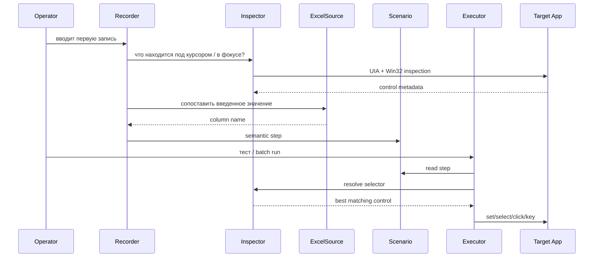

# Архитектура

## Принцип

Win Automator обучается на действиях оператора и сохраняет не «координату 541×318», а максимально устойчивый selector Windows-контрола. Координаты допустимы только как будущий fallback для интерфейсов, которые не раскрывают accessibility tree.

## Основные компоненты

`ExcelSource` читает `.xlsx` через openpyxl, нормализует строки и предоставляет значения для подстановки.

`SemanticRecorder` слушает глобальные события через pynput, агрегирует текстовый ввод и пытается превратить сырые события в действия более высокого уровня.

`Inspector` использует pywinauto UIA и Win32 backends. Selector может содержать:
- window title;
- automation id;
- control id;
- control type;
- name;
- class name;
- parent context.

`Scenario` — versioned JSON с последовательностью `Step`.

`Executor` резолвит selector, выполняет действие и контролирует timeout/retry.

`Storage` сохраняет checkpoint задания в SQLite, чтобы после ошибки или остановки не начинать пакет заново.

## Стабильность selector

Предпочтительный порядок признаков:

1. `AutomationId` / `ControlId`;
2. тип контрола;
3. имя/accessibility name;
4. класс;
5. родительский контекст;
6. окно;
7. относительное положение — только как fallback.

Это не абсолютная гарантия: приложение может менять accessibility tree между версиями. Поэтому интерфейс предусматривает повторный захват контрола.

## Границы MVP

В базовый слой намеренно не включены:
- OCR;
- OpenCV image matching;
- LLM;
- BPMN;
- произвольный scripting внутри scenario;
- сложные IF/ELSE.

Такие механизмы следует добавлять только после измерения реальных failure modes на целевом ПО.
